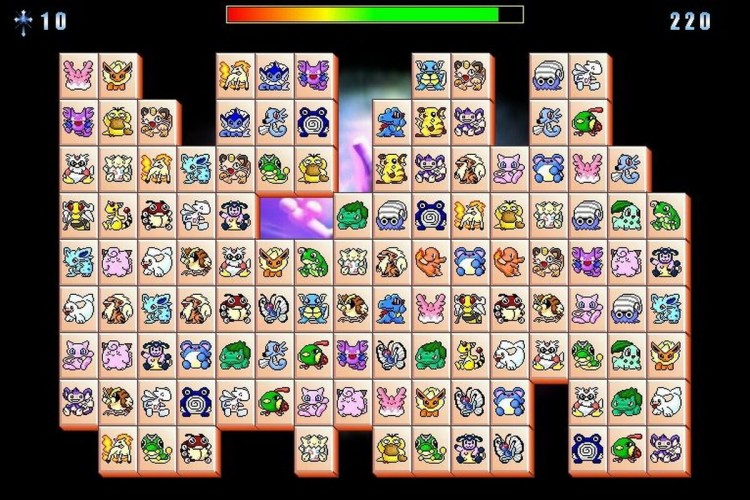

> A game inspired by an old .exe game with mahjong-like mechanics and Pokemon characters.

# How to play

To play it, simply open `index.html` or use the web version:

https://gulivan.github.io/pokemon-mahjong/

The goal is to find all pairs of characters but you have limited time and the path between two cards has to have up to 2 bends.

# Story behind this
Initially I made this game for my father. He didn't use to play games but this simple .exe game hooked him up and he used to play it occasionally.

Currently my parents don't use any laptop or computers so I thought to make the game available online so he'll be able to play it with his iPad.

Pokemons are copyrighted so in this port some Midjourney generated animals were used instead.

# How to add a new character or change the existing one

1. Add a new image to `characters` folder. Resize it to 512x512 (you can use online tool like [squosh](https://squoosh.app/))
2. Rename the image to `img_01.jpg`, `img_02.jpg`, etc. (you can use this command to do it automatically: `n=1; for f in *.jpg; do mv "$f" "$(printf 'img_%02d.jpg' "$n")"; ((n++)); done`)
3. Adjust `CHARACTER_COUNT` in `game.js`.

# Caveats / Future improvements

- Add more difficulty options.
- Add sound effects & music.
- Add more levels: move all cards to left/right and so on.
- Improve the logic of board generation. Currently it could be unsolvable 😅
- Add path animation
- Improve smoothness of the game.
